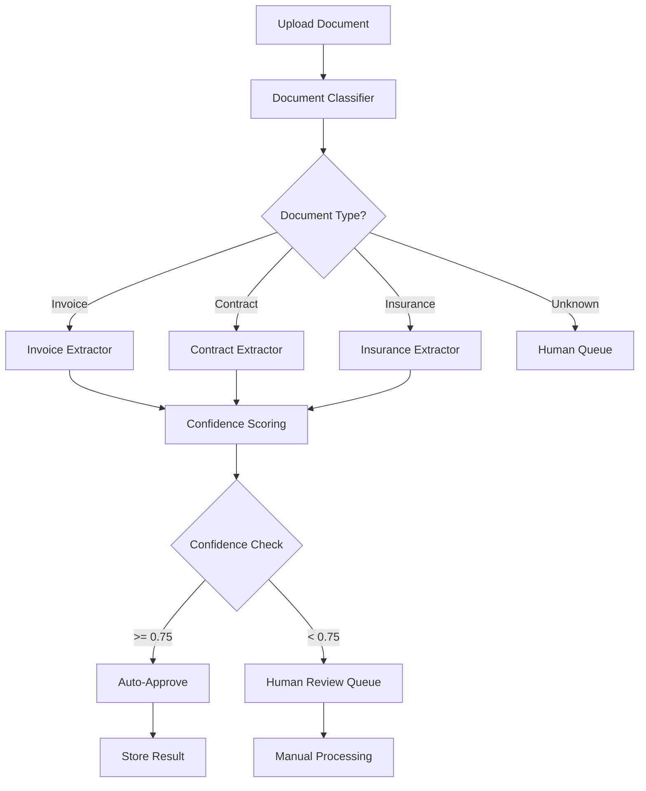
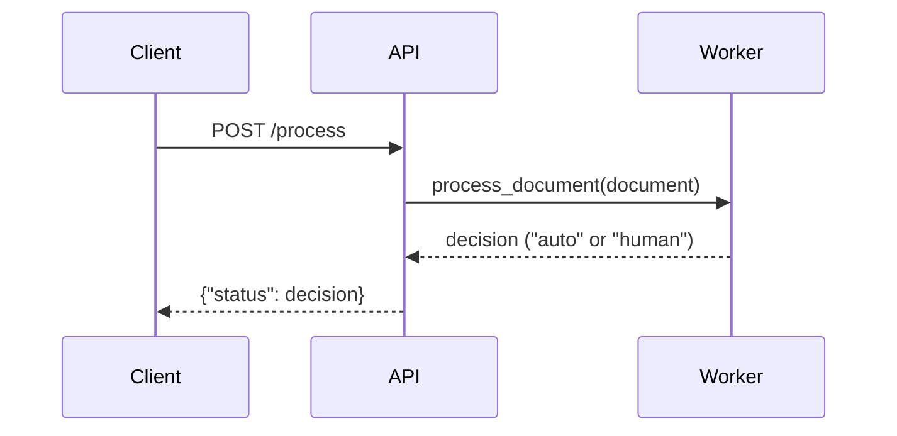
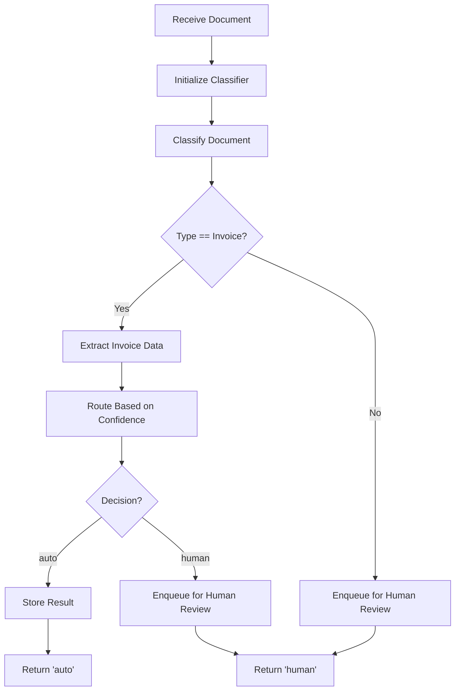
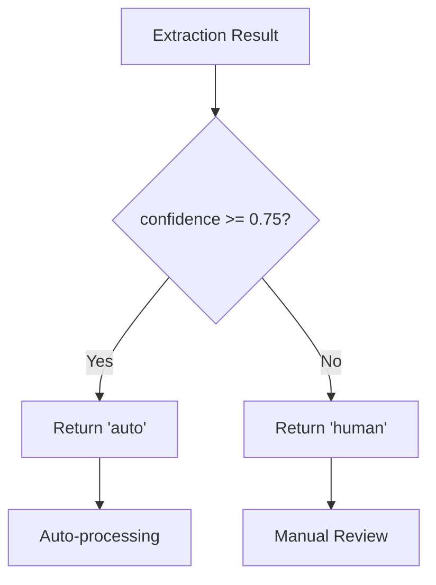
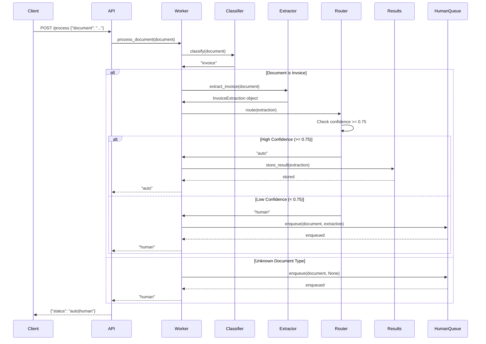
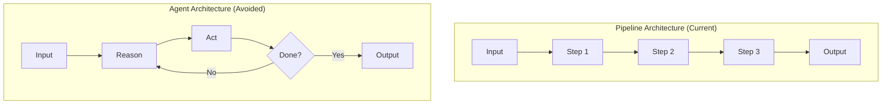

# Intelligent Document Processing Agent

## Overview

The Intelligent Document Processing (IDP) Agent is an enterprise grade document processing pipeline that automates the classification, extraction, validation and routing of business documents. Built with LangChain and FastAPI this system processes invoices, contracts and insurance claims with confidence based routing and human escalation capabilities.

## Problem Statement

Enterprises process thousands of documents daily including invoices, contracts, insurance claims, KYC documents and medical forms. Manual processing suffers from:

- Slow turnaround times
- Human errors and inconsistencies
- High operational costs
- Lack of auditability and traceability

## Solution

This IDP pipeline replaces manual processing with:

- Automated document classification
- Structured data extraction using LLM powered parsers
- Confidence based validation
- Intelligent routing (auto approval vs human review)
- Complete audit trail

## Core Design Principles

1. **Documents are untrusted input** - All inputs are validated and sanitized
2. **LLMs never directly modify state** - State changes are deterministic
3. **Schemas are contracts** - Pydantic models enforce data integrity
4. **Low confidence requires human review** - Safety first approach
5. **Everything is logged** - Complete audit trail
6. **Pipelines over agents** - No loops, pure deterministic orchestration

## High-Level Architecture



## Project Structure

```
intelligent-document-processing-agent/
│
├── api.py                          # FastAPI REST endpoint
├── worker.py                       # Core document processing logic
├── requirements.txt                # Python dependencies
├── idp.txt                        # System design documentation
│
├── chains/                        # LLM chain builders
│   ├── classify.py                # Document classification chain
│   ├── confidence.py              # Confidence scoring logic
│   ├── extract_contract.py        # Contract extraction chain
│   ├── extract_insurance.py       # Insurance extraction chain
│   └── extract_invoice.py         # Invoice extraction chain
│
├── prompts/                       # YAML prompt templates
│   ├── classify.yaml              # Classification prompt
│   ├── confidence.yaml            # Confidence evaluation prompt
│   ├── contract.yaml              # Contract extraction prompt
│   ├── insurance.yaml             # Insurance extraction prompt
│   └── invoice.yaml               # Invoice extraction prompt
│
├── routing/                       # Routing logic
│   └── router.py                  # Confidence-based routing decision
│
├── schemas/                       # Pydantic data models
│   ├── base.py                    # Base extraction schema
│   ├── contract.py                # Contract schema
│   ├── insurance.py               # Insurance schema
│   └── invoice.py                 # Invoice schema
│
└── storage/                       # Storage handlers
    ├── human_queue.py             # Human review queue
    └── results.py                 # Approved results storage
```

## Component Details

### 1. API Layer (api.py)

The REST API provides a single endpoint for document processing.

**Endpoint:** `POST /process`

**Input:**
```json
{
  "document": "string containing document text"
}
```

**Output:**
```json
{
  "status": "auto" | "human"
}
```

**Flow:**


### 2. Worker Module (worker.py)

The core orchestration engine that coordinates all processing steps.

**Key Functions:**

- `process_document(document: str) -> str`

**Processing Flow:**



**Code Implementation:**

```python
def process_document(document: str):
    # Step 1: Classify document type
    doc_type = classifier.invoke({
        "document": document
    }).content.strip().lower()

    # Step 2: Process if invoice
    if doc_type == "invoice":
        extraction = invoice_extractor.invoke({
            "document": document
        })

        # Step 3: Route based on confidence
        decision = route(extraction)

        # Step 4: Store or escalate
        if decision == "auto":
            store_result(extraction)
        else:
            enqueue(document, extraction)

        return decision

    # Step 5: Unknown/unsupported documents go to human
    enqueue(document, None)
    return "human"
```

### 3. Chains Module (chains/)

Contains LangChain chain builders for various processing tasks.

#### 3.1 Classification Chain (classify.py)

**Purpose:** Classifies documents into predefined categories.

**Function:** `build_classifier() -> Chain`

**Input:** `{"document": str}`

**Output:** Category string (invoice, contract, insurance, unknown)

**Implementation:**
```python
def build_classifier():
    # Load prompt template from YAML
    with open("prompts/classify.yaml") as f:
        data = yaml.safe_load(f)
    
    # Create prompt template
    prompt = ChatPromptTemplate.from_template(data['template'])
    
    # Initialize LLM with zero temperature for deterministic output
    llm = ChatOpenAI(model='gpt-4.1-mini', temperature=0.0)
    
    # Return chain: prompt | llm
    return prompt | llm
```

**Prompt Template (classify.yaml):**
```yaml
template: |
  Classify the document into ONE category:
  - invoice
  - contract
  - insurance
  - unknown

  Do not guess.

  Document:
  {document}

  Output only the category.
```

#### 3.2 Extraction Chains (extract_*.py)

**Purpose:** Extract structured data from classified documents using Pydantic schemas.

**Available Extractors:**
- `build_invoice_extractor()` - Extracts invoice data
- `build_contract_extractor()` - Extracts contract data
- `build_insurance_extractor()` - Extracts insurance claim data

**Generic Pattern:**

```python
def build_invoice_extractor():
    # 1. Create Pydantic parser for structured output
    parser = PydanticOutputParser(pydantic_object=InvoiceExtraction)
    
    # 2. Load prompt template
    with open("prompts/invoice.yaml") as f:
        data = yaml.safe_load(f)
    
    # 3. Create prompt with format instructions
    prompt = ChatPromptTemplate.from_template(
        data["template"]
    ).partial(
        format_instructions=parser.get_format_instructions()
    )
    
    # 4. Initialize LLM
    llm = ChatOpenAI(model="gpt-4.1", temperature=0.0)
    
    # 5. Return chain: prompt | llm | parser
    return prompt | llm | parser
```

**Chain Flow:**


**Input:** `{"document": str}`

**Output:** Pydantic object (InvoiceExtraction, ContractExtraction, or InsuranceExtraction)

#### 3.3 Confidence Scoring (confidence.py)

**Purpose:** Evaluates extraction quality and assigns confidence score.

**Function:** `score_confidence(document: str, extraction: str) -> float`

**Scoring Rules:**
- 0.9-1.0: All key fields clearly present and unambiguous
- 0.7-0.89: Most fields present, minor ambiguity
- 0.4-0.69: Partial extraction, missing or unclear fields
- 0.0-0.39: Weak or unsupported extraction

**Implementation:**

```python
def score_confidence(document: str, extraction: str) -> float:
    # Load confidence evaluation prompt
    with open("prompts/confidence.yaml") as f:
        data = yaml.safe_load(f)
    
    prompt = ChatPromptTemplate.from_template(data["template"])
    llm = ChatOpenAI(model="gpt-4.1-mini", temperature=0.0)
    
    # Invoke chain
    result = (prompt | llm).invoke({
        "document": document,
        "extraction": extraction
    }).content.strip()
    
    # Parse float score
    try:
        return float(result)
    except Exception:
        return 0.0  # Conservative default
```

### 4. Schemas Module (schemas/)

Defines Pydantic models for structured data extraction.

#### 4.1 Base Schema (base.py)

**Purpose:** Provides base extraction model with confidence field.

```python
from pydantic import BaseModel, Field

class BaseExtraction(BaseModel):
    confidence: float = Field(
        description="Confidence score between 0.0 and 1.0"
    )
```

**Design Rationale:** Every extraction must carry a confidence score to enable routing decisions.

#### 4.2 Document Specific Schemas

**Invoice Schema (invoice.py):**

```python
class InvoiceExtraction(BaseExtraction):
    invoice_number: str | None
    vendor_name: str | None
    total_amount: float | None
    currency: str | None
    due_date: str | None
```

**Contract Schema (contract.py):**

```python
class ContractExtraction(BaseExtraction):
    parties: list[str]
    start_date: str | None
    end_date: str | None
    governing_law: str | None
```

**Insurance Schema (insurance.py):**

```python
class InsuranceExtraction(BaseExtraction):
    policy_number: str | None
    claim_amount: float | None
    claimant_name: str | None
```

**Key Features:**
- All fields are nullable (accept None values)
- No inference of missing data
- Explicit typing for validation
- Inherits confidence field from BaseExtraction

### 5. Routing Module (routing/router.py)

**Purpose:** Makes deterministic routing decisions based on confidence scores.

**Configuration:**
```python
CONFIDENCE_THRESHOLD = 0.75
```

**Function:**
```python
def route(extraction):
    if extraction.confidence >= CONFIDENCE_THRESHOLD:
        return "auto"
    return "human"
```

**Decision Matrix:**

| Confidence Score | Decision | Action |
|-----------------|----------|--------|
| >= 0.75 | auto | Automatically approved and stored |
| < 0.75 | human | Escalated to human review queue |

**Flow Diagram:**



### 6. Storage Module (storage/)

Handles persistence of processed documents and human review queue.

#### 6.1 Results Storage (results.py)

**Purpose:** Stores successfully processed and auto-approved documents.

```python
_RESULTS = []

def store_result(result):
    _RESULTS.append(result)

def all_results():
    return _RESULTS
```

**Usage:** Called when confidence >= 0.75 and document is auto-approved.

#### 6.2 Human Queue (human_queue.py)

**Purpose:** Maintains queue of documents requiring human review.

```python
_HUMAN_QUEUE = []

def enqueue(document, extraction):
    _HUMAN_QUEUE.append({
        "document": document,
        "extraction": extraction
    })

def pending():
    return _HUMAN_QUEUE
```

**Queue Entry Structure:**
```python
{
    "document": str,          # Original document text
    "extraction": object      # Extraction result (can be None)
}
```

**Usage:** Called when:
- Document type is unknown/unsupported
- Confidence score < 0.75
- Any processing error occurs

## Complete Processing Flow

### End-to-End Sequence Diagram



### Detailed Step-by-Step Flow

#### Step 1: Document Receipt
**Input:** Raw document text via REST API
```json
POST /process
{
  "document": "INVOICE\nInvoice #: INV-2024-001\nVendor: Acme Corp\nTotal: $1,234.56 USD\nDue: 2024-12-31"
}
```

#### Step 2: Classification
**Module:** `chains/classify.py`

**Process:**
1. Load classification prompt from `prompts/classify.yaml`
2. Pass document to GPT-4.1-mini (temperature=0.0)
3. LLM returns category: invoice, contract, insurance, or unknown

**Output:** `"invoice"`

#### Step 3: Data Extraction
**Module:** `chains/extract_invoice.py`

**Process:**
1. Load invoice extraction prompt from `prompts/invoice.yaml`
2. Inject Pydantic schema format instructions
3. Pass document to GPT-4.1 (temperature=0.0)
4. Parse LLM output into InvoiceExtraction object

**Output:**
```python
InvoiceExtraction(
    confidence=0.92,
    invoice_number="INV-2024-001",
    vendor_name="Acme Corp",
    total_amount=1234.56,
    currency="USD",
    due_date="2024-12-31"
)
```

#### Step 4: Routing Decision
**Module:** `routing/router.py`

**Process:**
1. Check if `extraction.confidence >= 0.75`
2. Return "auto" if threshold met, else "human"

**Output:** `"auto"` (confidence is 0.92)

#### Step 5: Storage
**Module:** `storage/results.py`

**Process:**
1. Append extraction object to results list
2. Ready for downstream processing

**Final Output to Client:**
```json
{
  "status": "auto"
}
```

## Configuration and Setup

### Installation

**1. Clone the repository:**
```bash
git clone <repository-url>
cd intelligent-document-processing-agent
```

**2. Install dependencies:**
```bash
pip install -r requirements.txt
```

**Dependencies:**
- `langchain>=0.2.0` - LLM orchestration framework
- `langchain-openai>=0.1.7` - OpenAI integration
- `pydantic>=2.0` - Data validation and schema enforcement
- `python-dotenv>=1.0.0` - Environment variable management
- `fastapi>=0.110.0` - REST API framework
- `uvicorn>=0.29.0` - ASGI server
- `PyYAML>=6.0` - YAML parsing for prompts

**3. Set environment variables:**
```bash
export OPENAI_API_KEY="your-api-key-here"
```

Or create a `.env` file:
```
OPENAI_API_KEY=your-api-key-here
```

**4. Run the API server:**
```bash
uvicorn api:app --reload --port 8000
```

**5. Test the endpoint:**
```bash
curl -X POST http://localhost:8000/process \
  -H "Content-Type: application/json" \
  -d '{"document": "INVOICE\\nInvoice #: INV-001\\nVendor: Test Corp\\nTotal: $500.00"}'
```

### Configuration Parameters

#### Confidence Threshold
Located in `routing/router.py`:
```python
CONFIDENCE_THRESHOLD = 0.75
```

**Tuning Guidelines:**
- **0.9+** - Very conservative, more human review
- **0.75** - Balanced (default)
- **0.6** - Aggressive automation, higher risk

#### LLM Model Selection

**Classification (classify.py):**
- Model: `gpt-4.1-mini`
- Rationale: Fast, cost-effective for simple categorization
- Temperature: 0.0 (deterministic)

**Extraction (extract_*.py):**
- Model: `gpt-4.1`
- Rationale: Higher accuracy for structured data extraction
- Temperature: 0.0 (deterministic)

**Confidence Scoring (confidence.py):**
- Model: `gpt-4.1-mini`
- Rationale: Sufficient for scoring evaluation
- Temperature: 0.0 (deterministic)

## Key Design Decisions

### 1. Pipeline vs Agent Architecture

**Choice:** Pure deterministic pipeline (no agent loops)

**Rationale:**
- Predictable execution flow
- Easier debugging and testing
- No infinite loops or unpredictable behavior
- Clear audit trail
- Lower latency

**Comparison:**



### 2. Confidence-Based Routing

**Why confidence matters:**
- LLMs are probabilistic, not deterministic
- Extraction quality varies by document quality
- Manual review for low-confidence cases ensures accuracy
- Builds trust in automation

**Threshold Selection:**
- 0.75 balances automation and accuracy
- Configurable per use case
- Can be adjusted based on business requirements

### 3. Structured Output with Pydantic

**Benefits:**
- Type safety and validation
- Clear data contracts
- Automatic error handling
- Easy integration with downstream systems
- Self-documenting schemas

**Example:**
```python
# Without Pydantic (unstructured)
result = llm.invoke(document)
# result.content = "Invoice: INV-001, Amount: $500..."

# With Pydantic (structured)
result = extractor.invoke(document)
# result.invoice_number = "INV-001"
# result.total_amount = 500.0
```

### 4. Separation of Concerns

**Modular Design:**
- `chains/` - LLM interaction logic
- `schemas/` - Data models
- `routing/` - Business rules
- `storage/` - Persistence
- `prompts/` - LLM instructions

**Benefits:**
- Easy to test individual components
- Simple to add new document types
- Clear responsibility boundaries
- Maintainable codebase

### 5. Prompt Externalization (YAML)

**Why YAML files:**
- Non-developers can modify prompts
- Version control for prompt changes
- A/B testing different prompts
- No code changes for prompt updates
- Clear separation of logic and instructions

## Usage Examples

### Example 1: Processing an Invoice

**Request:**
```bash
curl -X POST http://localhost:8000/process \
  -H "Content-Type: application/json" \
  -d '{
    "document": "INVOICE\nInvoice Number: INV-2024-12345\nFrom: Tech Solutions Inc\nAmount Due: $2,500.00 USD\nDue Date: 2024-02-15"
  }'
```

**Processing Steps:**
1. Classifier identifies: `"invoice"`
2. Invoice extractor parses fields
3. Confidence score: 0.95 (high)
4. Router decision: `"auto"`
5. Stored in results

**Response:**
```json
{
  "status": "auto"
}
```

### Example 2: Low Confidence Document

**Request:**
```bash
curl -X POST http://localhost:8000/process \
  -H "Content-Type: application/json" \
  -d '{
    "document": "Invoice maybe? Some numbers: 500, date could be tomorrow"
  }'
```

**Processing Steps:**
1. Classifier identifies: `"invoice"` (with uncertainty)
2. Invoice extractor attempts parsing
3. Confidence score: 0.45 (low)
4. Router decision: `"human"`
5. Added to human queue

**Response:**
```json
{
  "status": "human"
}
```

### Example 3: Unknown Document Type

**Request:**
```bash
curl -X POST http://localhost:8000/process \
  -H "Content-Type: application/json" \
  -d '{
    "document": "This is a random note about meeting tomorrow at 3pm"
  }'
```

**Processing Steps:**
1. Classifier identifies: `"unknown"`
2. No extraction attempted
3. Immediately routed to human queue

**Response:**
```json
{
  "status": "human"
}
```

## Extension Guide

### Adding a New Document Type

Follow these steps to add support for a new document type (e.g., "receipt"):

**Step 1: Create Schema**

Create `schemas/receipt.py`:
```python
from schemas.base import BaseExtraction

class ReceiptExtraction(BaseExtraction):
    receipt_number: str | None
    merchant_name: str | None
    total_amount: float | None
    purchase_date: str | None
```

**Step 2: Create Prompt Template**

Create `prompts/receipt.yaml`:
```yaml
template: |
  Extract receipt information.
  
  Rules:
  - Do not infer missing data.
  - Use null when unknown.
  
  Document:
  {document}
  
  {format_instructions}
```

**Step 3: Create Extractor Chain**

Create `chains/extract_receipt.py`:
```python
import yaml
from langchain_openai import ChatOpenAI
from langchain.output_parsers import PydanticOutputParser
from langchain_core.prompts import ChatPromptTemplate
from schemas.receipt import ReceiptExtraction

def build_receipt_extractor():
    parser = PydanticOutputParser(pydantic_object=ReceiptExtraction)
    
    with open("prompts/receipt.yaml") as f:
        data = yaml.safe_load(f)
    
    prompt = ChatPromptTemplate.from_template(
        data["template"]
    ).partial(
        format_instructions=parser.get_format_instructions()
    )
    
    llm = ChatOpenAI(model="gpt-4.1", temperature=0.0)
    
    return prompt | llm | parser
```

**Step 4: Update Worker Logic**

Modify `worker.py` to handle receipt documents.

### Production Considerations

**Security:**
- Validate and sanitize all input documents
- Implement rate limiting on API endpoints
- Use authentication/authorization for production
- Encrypt sensitive data in storage
- Implement audit logging for compliance

**Scalability:**
- Replace in-memory storage with databases (PostgreSQL, MongoDB)
- Add message queue for async processing (Celery, RabbitMQ)
- Implement caching for frequently accessed data
- Use connection pooling for database connections
- Deploy with horizontal scaling (Kubernetes, Docker Swarm)

**Monitoring:**
- Add structured logging (structlog, python-json-logger)
- Implement metrics collection (Prometheus)
- Set up alerting for failures
- Track processing times and confidence scores
- Monitor LLM API usage and costs

**Error Handling:**
- Implement retry logic for transient failures
- Add circuit breakers for external services
- Create dead letter queues for failed documents
- Log all errors with context
- Implement graceful degradation

## Technology Stack

| Component | Technology | Purpose |
|-----------|-----------|---------|
| Web Framework | FastAPI | REST API endpoints |
| LLM Framework | LangChain | LLM orchestration and chaining |
| LLM Provider | OpenAI | GPT-4.1 and GPT-4.1-mini models |
| Data Validation | Pydantic | Schema enforcement and validation |
| Config Management | PyYAML | Prompt template storage |
| Server | Uvicorn | ASGI server for FastAPI |

## Performance Characteristics

**Latency:**
- Classification: ~1-2 seconds (GPT-4.1-mini)
- Extraction: ~2-4 seconds (GPT-4.1)
- Total per document: ~3-6 seconds

**Cost Estimation (per 1000 documents):**
- Classification: \.15-0.30
- Extraction: \.60-1.20
- Total: \.75-1.50

**Throughput:**
- Single instance: ~10-20 documents/minute
- With scaling: 100+ documents/minute

## Future Enhancements

1. **Multi-modal Support:** Add OCR and image processing for scanned documents
2. **Active Learning:** Feedback loop from human reviewers to improve models
3. **Custom Models:** Fine-tune models on domain-specific data
4. **Batch Processing:** Process multiple documents simultaneously
5. **Webhook Support:** Notify external systems on completion
6. **Dashboard:** Web UI for monitoring and human review
7. **A/B Testing:** Compare different prompts and models
8. **Export Formats:** Support CSV, Excel, JSON exports

## Troubleshooting

**Issue: Low confidence scores across all documents**
- Solution: Adjust prompts for clarity, consider fine-tuning models, or lower threshold

**Issue: Incorrect classifications**
- Solution: Review and improve classification prompt, add more examples, check document format

**Issue: Extraction returning null values**
- Solution: Verify document format matches expected structure, improve extraction prompts

**Issue: High API costs**
- Solution: Use cheaper models for classification, implement caching, batch similar requests

**Issue: Slow processing times**
- Solution: Implement async processing, use parallel extraction for multiple fields, upgrade LLM tier

## Contributing

When adding new features:
1. Follow the existing modular architecture
2. Add appropriate Pydantic schemas for new document types
3. Externalize prompts to YAML files
4. Maintain deterministic pipeline approach
5. Include comprehensive error handling
6. Update documentation and examples
