# Multi Tenant Enterprise RAG Platform

A production grade, multi tenant Retrieval Augmented Generation (RAG) system built with LangChain and FastAPI. This platform provides strict tenant isolation, per tenant vector stores, prompt versioning, cost budgets and policy driven model routing.

## Table of Contents

- [Overview](#overview)
- [Key Features](#key-features)
- [Architecture](#architecture)
- [System Design](#system-design)
- [Module Documentation](#module-documentation)
- [Request Flow](#request-flow)
- [Data Models](#data-models)
- [Security & Isolation](#security--isolation)
- [Setup & Installation](#setup--installation)
- [API Reference](#api-reference)
- [Configuration](#configuration)

## Overview

Companies require a single AI platform that serves multiple customers while ensuring each tenant owns its data, has isolated memory, enforces cost limits, uses custom prompts and guarantees zero data leakage.

### The Problem with Naive RAG

Traditional RAG implementations fail in multi tenant environments because:

- Shared vector stores leak data across tenants
- Prompts are global and non customizable
- Costs explode without per tenant limits
- One tenant can cause Denial of Service (DOS) for others
- No isolation guarantees

### Our Solution

This system guarantees:

- Hard tenant isolation
- Per tenant vector stores
- Per tenant prompt versions
- Per tenant cost budgets
- Per tenant model routing
- Auditable decisions
- Safe defaults

## Key Features

### 1. Tenant Isolation
Every tenant operates in a completely isolated environment with dedicated resources.

### 2. Cost Management
Per tenant token budgets prevent runaway costs and ensure fair resource allocation.

### 3. Prompt Versioning
Different tenants can use different prompt versions tailored to their needs.

### 4. Model Tiering
Three tier model selection (cheap, balanced, premium) based on tenant configuration.

### 5. Vector Store Isolation
Each tenant has a dedicated FAISS vector store to prevent data leakage.

### 6. Confidence Scoring
Responses include confidence scores based on retrieval quality.

## Architecture

### High Level System Architecture

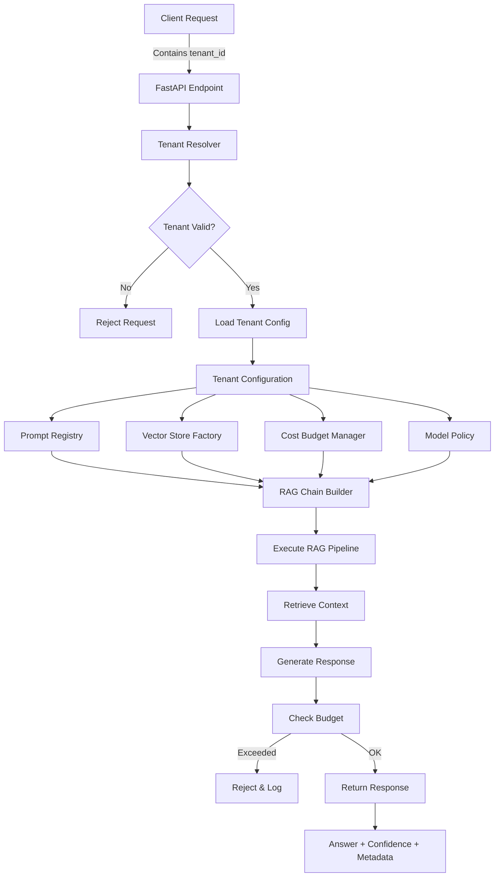

### Component Architecture

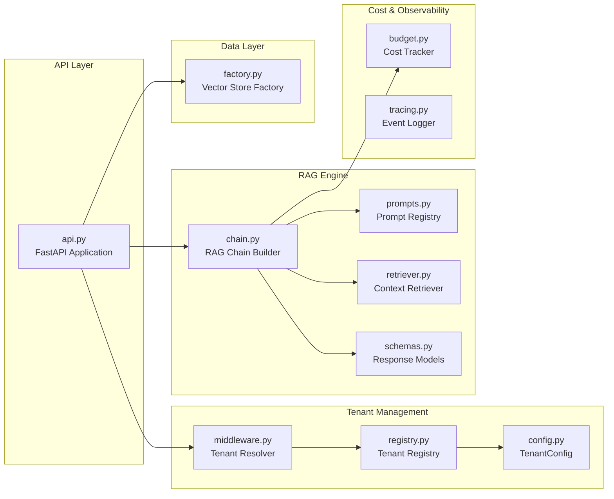

## System Design

### Request Processing Pipeline

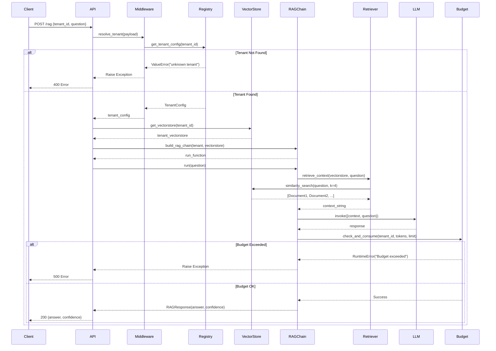

## Module Documentation

### API Layer

#### `api.py`

The main FastAPI application that exposes the RAG endpoint.

**Functions:**

```python
@app.post("/rag")
def rag_endpoint(payload: dict)
```

**Input:**
```json
{
  "tenant_id": "acme",
  "question": "What is the company policy on remote work?"
}
```

**Output:**
```json
{
  "answer": "According to the policy...",
  "confidence": 0.85
}
```

**Flow:**

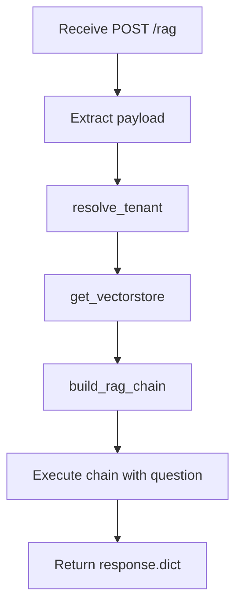

### Tenant Management

#### `tenant/middleware.py`

Resolves tenant identity and enforces tenant validation.

**Functions:**

```python
def resolve_tenant(request: dict) -> TenantConfig
```

**Input:** Request dictionary containing `tenant_id`

**Output:** `TenantConfig` object

**Error Handling:**
- Raises `ValueError` if `tenant_id` is missing
- Raises `ValueError` if tenant is unknown (propagated from registry)

**Code Flow:**

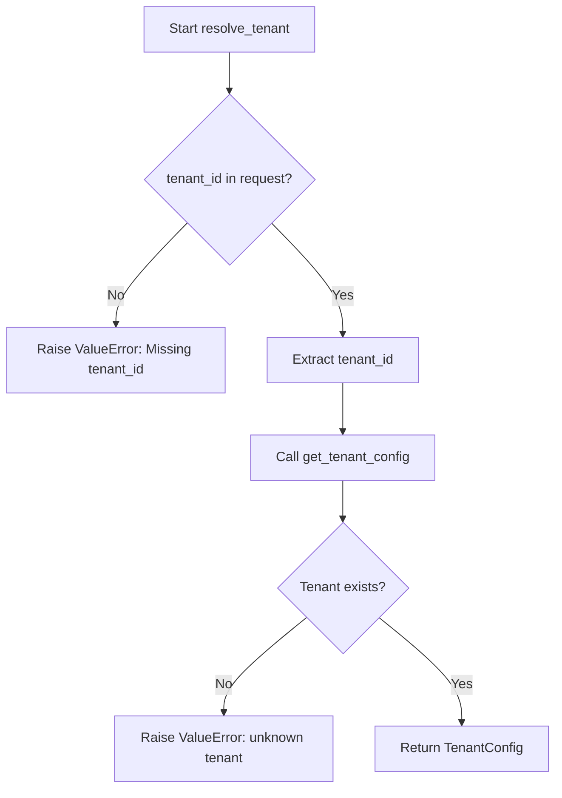

#### `tenant/registry.py`

Central registry for all tenant configurations.

**Data Structure:**

```python
_TENANTS = {
    "acme": TenantConfig(...),
    "globex": TenantConfig(...)
}
```

**Functions:**

```python
def get_tenant_config(tenant_id: str) -> TenantConfig
```

**Pre-configured Tenants:**

| Tenant ID | Prompt Version | Max Tokens/Day | Model Tier |
|-----------|----------------|----------------|------------|
| acme      | v1             | 50,000         | balanced   |
| globex    | v2             | 200,000        | premium    |

#### `tenant/config.py`

Defines the tenant configuration data structure.

**Data Class:**

```python
@dataclass
class TenantConfig:
    tenant_id: str              # Unique tenant identifier
    prompt_version: str         # Prompt template version (v1, v2)
    max_tokens_per_day: int     # Daily token budget
    model_tier: str             # Model selection: cheap|balanced|premium
```

### RAG Engine

#### `rag/chain.py`

Core RAG chain builder that orchestrates the entire RAG pipeline.

**Functions:**

```python
def build_rag_chain(tenant_config: TenantConfig, vectorstore) -> Callable
```

**Input:**
- `tenant_config`: TenantConfig object
- `vectorstore`: FAISS vector store instance

**Output:** A callable `run(question: str)` function

**Internal Flow:**

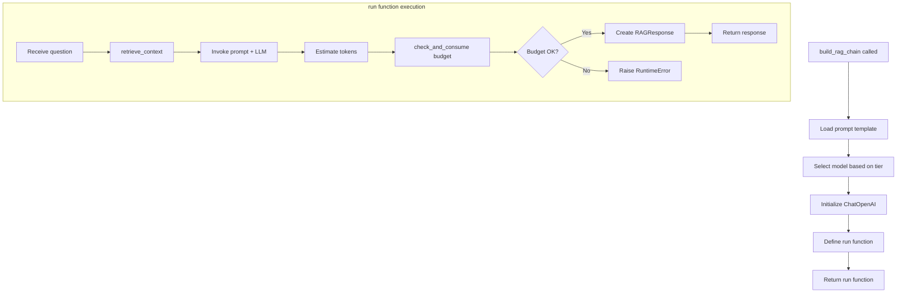

**Model Tier Mapping:**

```python
{
    "cheap": "gpt-4.1-mini",
    "balanced": "gpt-4.1",
    "premium": "gpt-4.1"
}
```

**Confidence Scoring:**
- `0.85` if context is retrieved
- `0.3` if no context available

#### `rag/prompts.py`

Manages versioned prompt templates.

**Available Prompts:**

**Version 1 (v1):**
```
Answer using ONLY the provided context.
If unsure, say you don't know.

Context:
{context}

Question:
{question}
```

**Version 2 (v2):**
```
You are a premium assistant.
Be precise and concise.
Use only the context.

Context:
{context}

Question:
{question}
```

**Functions:**

```python
def get_prompt(version: str) -> str
```

**Input:** Prompt version string ("v1", "v2")

**Output:** Formatted prompt template string

#### `rag/retriever.py`

Handles context retrieval from vector stores.

**Functions:**

```python
def retrieve_context(vectorstore, question: str, k: int = 4) -> str
```

**Input:**
- `vectorstore`: FAISS vector store instance
- `question`: User's question
- `k`: Number of documents to retrieve (default: 4)

**Output:** Concatenated string of document contents

**Process:**

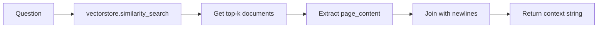

#### `rag/schemas.py`

Defines response data models using Pydantic.

**Models:**

```python
class RAGResponse(BaseModel):
    answer: str         # Generated answer from LLM
    confidence: float   # Confidence score (0.0 - 1.0)
```

### Vector Store Management

#### `vectorstore/factory.py`

Factory pattern for creating and managing per-tenant vector stores.

**Functions:**

```python
def get_vectorstore(tenant_id: str) -> FAISS
```

**Input:** Tenant ID string

**Output:** FAISS vector store instance

**Behavior:**

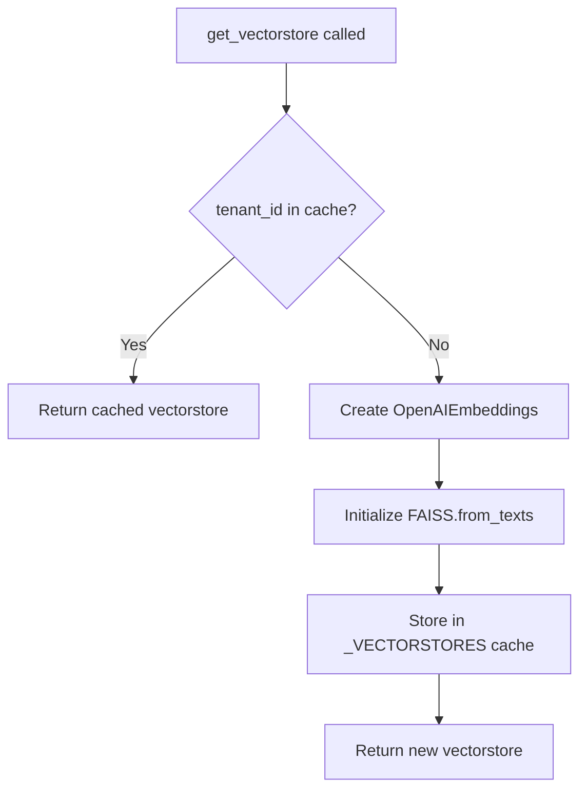

**Storage:**
- In-memory dictionary `_VECTORSTORES`
- Lazy initialization
- Persistent across requests within same process

### Cost Management

#### `cost/budget.py`

Tracks and enforces per-tenant token budgets.

**Functions:**

```python
def check_and_consume(tenant_id: str, tokens: int, limit: int)
```

**Input:**
- `tenant_id`: Tenant identifier
- `tokens`: Number of tokens to consume
- `limit`: Maximum allowed tokens

**Output:** None (raises exception on budget exceeded)

**Logic:**

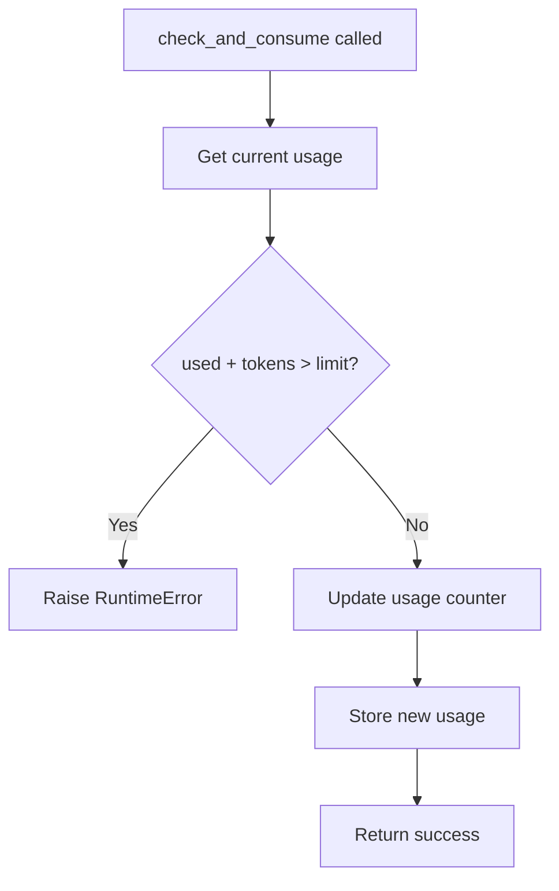

**State Management:**
- Global dictionary `_USAGE` stores token counts
- Simple accumulator pattern
- No reset mechanism (would need external cron/scheduler)

### Observability

#### `observability/tracing.py`

Basic event logging for debugging and auditing.

**Functions:**

```python
def trace(event: str, payload: dict)
```

**Input:**
- `event`: Event name/type
- `payload`: Additional event data

**Output:** Prints formatted event to console

**Format:**
```python
{
    "event": "event_name",
    "key1": "value1",
    "key2": "value2"
}
```

## Request Flow

### Complete End to End Flow

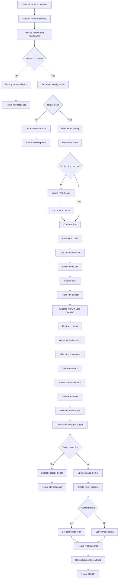

## Data Models

### TenantConfig

```python
@dataclass
class TenantConfig:
    tenant_id: str              # Example: "acme"
    prompt_version: str         # Example: "v1"
    max_tokens_per_day: int     # Example: 50000
    model_tier: str             # Values: "cheap" | "balanced" | "premium"
```

### RAGResponse

```python
class RAGResponse(BaseModel):
    answer: str                 # Generated answer text
    confidence: float           # Range: 0.0 to 1.0
```

### Request Payload

```python
{
    "tenant_id": str,           # Required: Tenant identifier
    "question": str             # Required: User's question
}
```

## Security & Isolation

### Edge Case Handling

| Edge Case | Handling Strategy | Implementation |
|-----------|-------------------|----------------|
| Unknown tenant | Hard reject with error | `ValueError` in `get_tenant_config` |
| Budget exceeded | Stop request immediately | `RuntimeError` in `check_and_consume` |
| Empty retrieval | Return low confidence | Confidence = 0.3 when no context |
| Prompt mismatch | Version-controlled prompts | Tenant-specific prompt versions |
| Cross-tenant access | Impossible by design | Separate vector stores per tenant |
| Model abuse | Policy-controlled | Tenant-specific model tier limits |
| Missing tenant_id | Reject early | Check in `resolve_tenant` |

### Isolation Guarantees

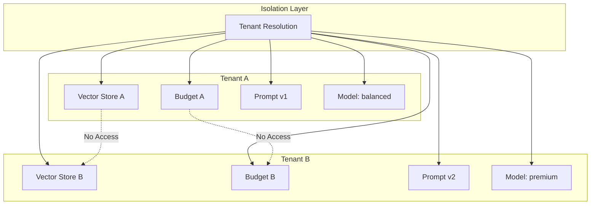

### Security Principles

1. **Tenant Identification**: Every request must contain `tenant_id`
2. **Vector Store Isolation**: Each tenant has a dedicated FAISS instance
3. **Budget Enforcement**: Token consumption tracked per-tenant
4. **Configuration Isolation**: Tenant configs stored separately
5. **No Shared State**: All tenant data is partitioned

## Setup & Installation

### Prerequisites

- Python 3.8+
- OpenAI API key

### Installation Steps

1. Clone the repository:
```bash
git clone https://github.com/aaryan182/langchain_prod_agents.git
cd multi-tenant-enterprise-rag
```

2. Install dependencies:
```bash
pip install -r requirements.txt
```

3. Set up environment variables:
```bash
export OPENAI_API_KEY="your-api-key-here"
```

### Dependencies

```
langchain>=0.2.0          # Core RAG framework
langchain-openai>=0.1.7   # OpenAI integration
pydantic>=2.0             # Data validation
fastapi>=0.110.0          # Web framework
uvicorn>=0.29.0           # ASGI server
python-dotenv>=1.0.0      # Environment management
faiss-cpu>=1.8.0          # Vector similarity search
```

### Running the Application

```bash
uvicorn api:app --reload --host 0.0.0.0 --port 8000
```

The API will be available at `http://localhost:8000`

### API Documentation

Once running, visit:
- Swagger UI: `http://localhost:8000/docs`
- ReDoc: `http://localhost:8000/redoc`

## API Reference

### POST /rag

Execute a RAG query for a specific tenant.

**Endpoint:** `/rag`

**Method:** `POST`

**Request Body:**

```json
{
  "tenant_id": "acme",
  "question": "What is the refund policy?"
}
```

**Response (Success - 200):**

```json
{
  "answer": "The refund policy allows returns within 30 days...",
  "confidence": 0.85
}
```

**Response (Missing tenant_id - 400):**

```json
{
  "detail": "Missing tenant_id"
}
```

**Response (Unknown tenant - 400):**

```json
{
  "detail": "unknown tenant"
}
```

**Response (Budget exceeded - 500):**

```json
{
  "detail": "Tenant token budget exceeded"
}
```

### Example Usage

**cURL:**

```bash
curl -X POST "http://localhost:8000/rag" \
  -H "Content-Type: application/json" \
  -d '{
    "tenant_id": "acme",
    "question": "What are the business hours?"
  }'
```

**Python:**

```python
import requests

response = requests.post(
    "http://localhost:8000/rag",
    json={
        "tenant_id": "acme",
        "question": "What are the business hours?"
    }
)

result = response.json()
print(f"Answer: {result['answer']}")
print(f"Confidence: {result['confidence']}")
```

**JavaScript:**

```javascript
fetch('http://localhost:8000/rag', {
  method: 'POST',
  headers: {
    'Content-Type': 'application/json',
  },
  body: JSON.stringify({
    tenant_id: 'acme',
    question: 'What are the business hours?'
  })
})
.then(response => response.json())
.then(data => {
  console.log('Answer:', data.answer);
  console.log('Confidence:', data.confidence);
});
```

## Configuration

### Adding a New Tenant

Edit `tenant/registry.py`:

```python
_TENANTS = {
    "new_tenant": TenantConfig(
        tenant_id="new_tenant",
        prompt_version="v1",           # or "v2"
        max_tokens_per_day=100_000,    # Set budget
        model_tier="balanced"          # cheap|balanced|premium
    ),
    # ... existing tenants
}
```

### Adding a New Prompt Version

Edit `rag/prompts.py`:

```python
PROMPTS = {
    "v3": """
    Your custom prompt template here.
    
    Context:
    {context}
    
    Question:
    {question}
    """,
    # ... existing prompts
}
```

### Adjusting Model Tiers

Edit `rag/chain.py`:

```python
model_name = {
    "cheap": "gpt-3.5-turbo",      # Modify model names
    "balanced": "gpt-4",
    "premium": "gpt-4-turbo"
}[tenant_config.model_tier]
```

### Changing Retrieval Parameters

Edit `rag/retriever.py`:

```python
def retrieve_context(vectorstore, question: str, k: int = 8):  # Change k value
    docs = vectorstore.similarity_search(question, k=k)
    return "\n".join(d.page_content for d in docs)
```

## Project Structure

```
multi-tenant-enterprise-rag/
│
├── api.py                      # FastAPI application entry point
├── requirements.txt            # Python dependencies
├── mte.txt                     # System design documentation
│
├── cost/
│   └── budget.py              # Token budget tracking and enforcement
│
├── observability/
│   └── tracing.py             # Event logging and tracing
│
├── rag/
│   ├── chain.py               # RAG chain builder and orchestrator
│   ├── prompts.py             # Versioned prompt templates
│   ├── retriever.py           # Context retrieval from vector stores
│   └── schemas.py             # Response data models
│
├── tenant/
│   ├── config.py              # Tenant configuration data class
│   ├── middleware.py          # Tenant resolution and validation
│   └── registry.py            # Tenant registry and lookup
│
└── vectorstore/
    └── factory.py             # Vector store factory and caching
```

## Best Practices

### For Developers

1. **Always validate tenant_id first** - Fail fast on invalid tenants
2. **Use proper error handling** - Return appropriate HTTP status codes
3. **Monitor token usage** - Implement alerts for budget thresholds
4. **Test isolation** - Ensure no cross-tenant data leakage
5. **Version prompts carefully** - Document changes between versions

### For Operations

1. **Set appropriate budgets** - Based on expected usage patterns
2. **Monitor vector store sizes** - Implement cleanup strategies
3. **Track API latency** - RAG queries can be slow with large contexts
4. **Implement rate limiting** - Prevent abuse beyond token budgets
5. **Backup tenant configs** - Store registry in persistent storage

### Performance Considerations

1. **Vector Store Caching**: Stores are cached in memory for fast access
2. **Token Estimation**: Uses simple word-count heuristic (conservative)
3. **Concurrent Requests**: Multiple tenants can query simultaneously
4. **Embedding Generation**: First query per tenant is slower (initialization)

## Limitations & Future Enhancements

### Current Limitations

1. **In-Memory Storage**: Vector stores and budgets are not persisted
2. **Simple Token Counting**: Word-based estimation is approximate
3. **No Budget Reset**: Daily limits don't automatically reset
4. **Limited Observability**: Basic console logging only
5. **No Authentication**: Relies on tenant_id without verification

### Potential Enhancements

1. **Persistent Storage**
   - Use Redis for budget tracking
   - Store vector stores in PostgreSQL with pgvector
   - Implement proper database migrations

2. **Advanced Cost Management**
   - Real token counting using tiktoken
   - Automatic daily budget resets
   - Budget alerts and notifications
   - Cost analytics dashboard

3. **Enhanced Security**
   - API key authentication per tenant
   - JWT token validation
   - Audit logging for compliance
   - Data encryption at rest

4. **Improved Observability**
   - OpenTelemetry integration
   - Prometheus metrics
   - Grafana dashboards
   - Request tracing with correlation IDs

5. **Scalability**
   - Horizontal scaling with load balancers
   - Distributed vector stores
   - Caching layer (Redis)
   - Async processing queues

6. **Feature Additions**
   - Document upload API
   - Batch processing
   - Custom embedding models per tenant
   - A/B testing for prompts
   - Feedback loop for answer quality

## Troubleshooting

### Common Issues

**Issue: "Missing tenant_id" error**
```
Solution: Ensure request payload includes tenant_id field
```

**Issue: "unknown tenant" error**
```
Solution: Add tenant to registry.py or check tenant_id spelling
```

**Issue: "Tenant token budget exceeded" error**
```
Solution: Increase max_tokens_per_day or reset usage counter
```

**Issue: Empty or low-quality answers**
```
Solution: 
- Add documents to tenant's vector store
- Adjust retrieval parameter k
- Try different prompt version
```

**Issue: Slow response times**
```
Solution:
- Reduce k in retriever (fewer documents)
- Use "cheap" model tier
- Check OpenAI API latency
```

## Contributing

Guidelines for contributing to this project:

1. Fork the repository
2. Create a feature branch
3. Implement changes with tests
4. Ensure tenant isolation is maintained
5. Update documentation
6. Submit pull request

Built with LangChain, FastAPI, and FAISS for secure multi-tenant RAG applications.
